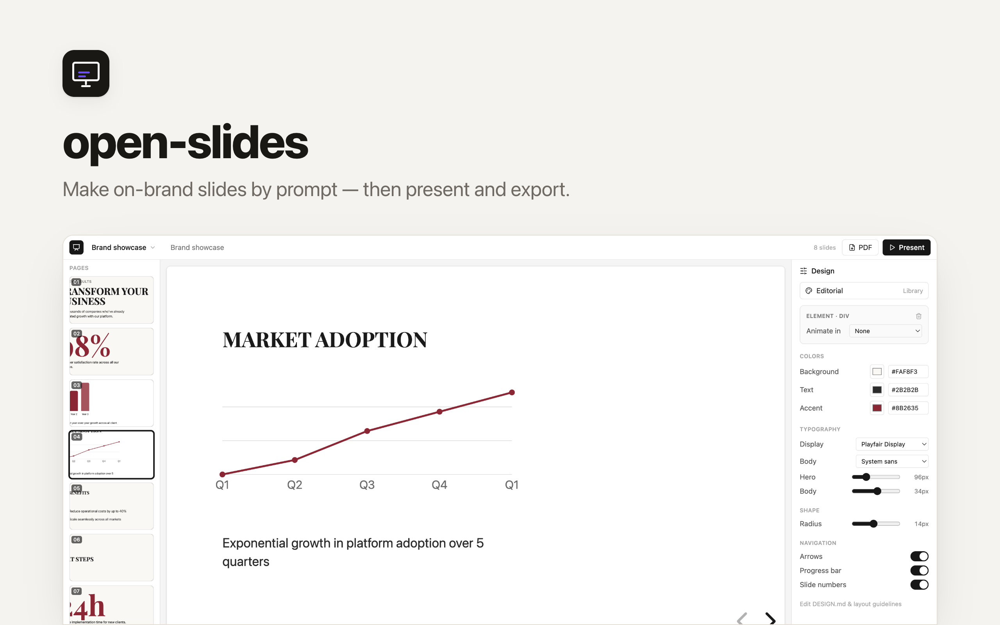

# Open Slides



An open-source, **agent-friendly slide maker**. Design **on-brand slides**, drop
in your own logos and images, **present fullscreen right in the browser**, and
export to **PDF**.

Built on **[reveal.js](https://github.com/hakimel/reveal.js)** (MIT) — each slide
is a small block of HTML styled by a shared brand, so humans can tweak it and AI
agents can author it end to end. No proprietary slide format, no per-seat license.

## Why

Most slide tools lock your content into a binary format or a paid editor. Here a
deck is **HTML styled by a brand** — one idea per slide, slides separated by
`---`, every color and font driven by the brand's design tokens. That makes it
trivial for an agent to generate on-brand decks and trivial for a person to edit
visually (click any element) or in code.

## Features

- **Visual editor** — a page rail, a live canvas, and a design inspector. Click
  any text, image, or background to edit it; or prompt the AI to build slides.
- **Brand library** — each deck inherits a brand (colors, fonts, logo, layout)
  authored as a `DESIGN.md`, so slides are on-brand by construction.
- **Present in the browser** — one click goes fullscreen with arrow-key
  navigation, speaker notes, and entrance animations. Nothing to install.
- **Bring your own media** — upload logos and images and place them on a slide;
  unused media is cleaned up automatically.
- **Export to PDF** — one click produces a clean, one-slide-per-page PDF you can
  share or print.
- **Agent-ready** — a clean REST API (`/api/decks`, `/api/assets`) and an
  `agent.md` so an AI agent can author and present decks without a human in the
  loop.

## How a deck works

A deck is one document; slides are separated by `---`, and each slide is HTML
styled with the brand's CSS variables:

```html
<div style="position:absolute;inset:0;display:flex;flex-direction:column;justify-content:center;padding:0 9%">
  <div class="kicker">Your kicker</div>
  <h1 style="font:700 var(--brand-hero-size) var(--r-heading-font);color:var(--brand-heading)">Your Presentation</h1>
  <p style="color:var(--brand-muted)">A supporting subtitle.</p>
</div>
```

The editor renders slides live and keeps your place as you edit. New decks start
from designed templates; you rarely write this HTML by hand.

## Quickstart

```bash
pnpm install
pnpm dev        # editor UI + API, with a local database & storage
```

Open the editor, hit **New deck** for a starter, add designed slides or prompt
the AI, drop in media from the **Design** panel, and click **Present**.

## Deploy

This is a [Clawnify](https://clawnify.com) app — deploy it to your org with the
CLI:

```bash
npx clawnify deploy
```

PDF export runs on Clawnify's managed render service, so deployed instances need
no local browser or PDF toolchain.

## Project layout

```
src/
  client/app.tsx     # editor UI: decks, slides, live preview, present, export
  server/            # REST API (decks, assets) + reveal.js view + PDF export
agent.md             # how an AI agent authors and presents decks
```

## License

MIT for this app. reveal.js is MIT.
